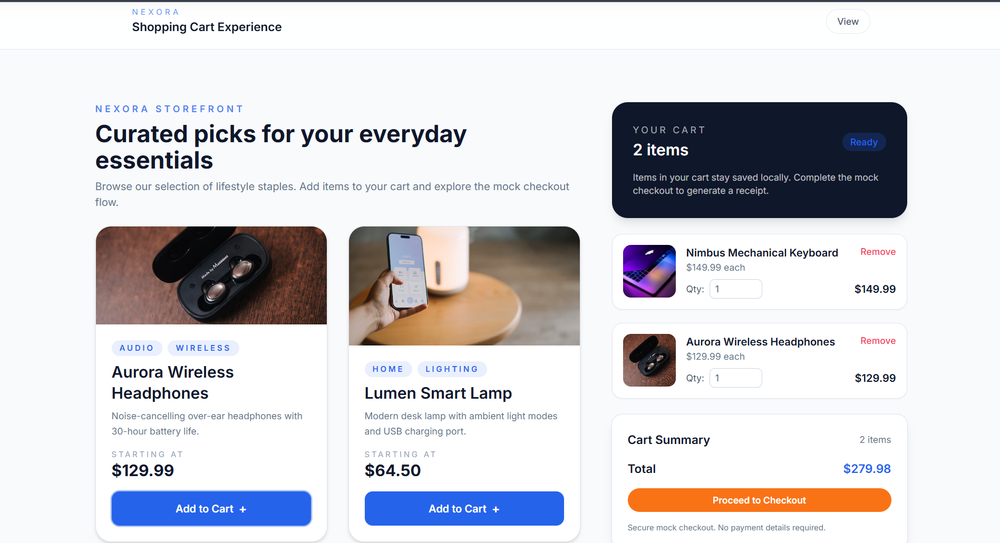
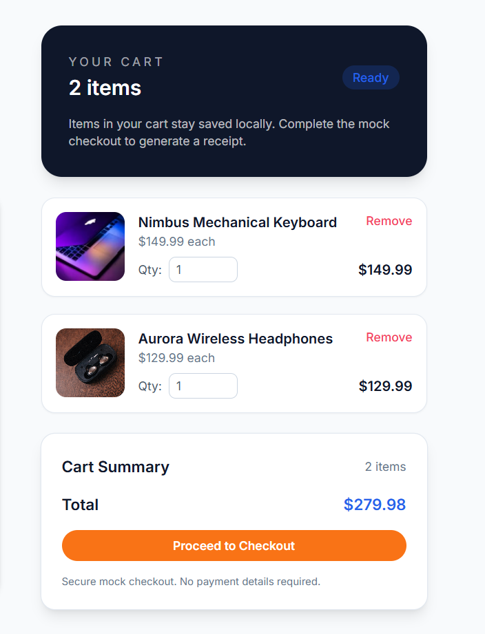
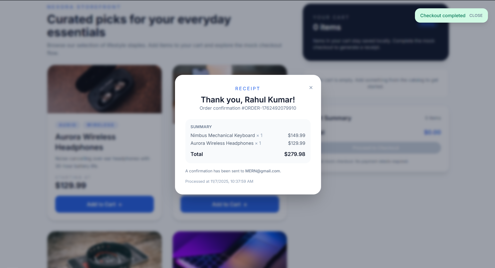

# Nexora Shopping Cart

A full-stack shopping cart experience built for the Nexora internship screening. The project showcases a modern React frontend with a Node.js/Express backend and optional MongoDB persistence. The app simulates a lightweight e-commerce flow with product browsing, cart interactions, and a mock checkout receipt.

## Highlights

- 🎯 Responsive React UI (Vite + Tailwind CSS) optimised for mobile-first shopping.
- 🛒 Realistic cart UX with quantity updates, inline totals, and instant state sync.
- 🔌 RESTful Express API with optional MongoDB persistence and in-memory fallback.
- ✅ Schema validation, graceful error handling, and structured responses.
- 🧾 Mock checkout that returns a shareable receipt payload.

## Project Structure

```
.
├── backend
│   ├── package.json
│   └── src
│       ├── controllers
│       ├── db
│       ├── middleware
│       ├── models
│       ├── routes
│       └── server.js
├── frontend
│   ├── package.json
│   └── src
│       ├── api
│       ├── components
│       ├── hooks
│       ├── pages
│       ├── utils
│       ├── App.jsx
│       └── main.jsx
└── README.md
```

## Prerequisites

- Node.js 18+
- npm 9+
- MongoDB instance (Atlas cluster or local `mongod`)

## Quick Start

```bash
# 1. Install dependencies
cd backend && npm install
cd ../frontend && npm install

# 2. (Optional) Seed MongoDB with sample catalog
cd ../backend
npm run seed

# 3. Run backend API (defaults to port 5000)
npm run dev

# 4. Run frontend (defaults to port 5173)
cd ../frontend
npm run dev
```

> Set `VITE_API_URL` in `frontend/.env` if the API is hosted anywhere other than `http://localhost:5000/api`.

## Environment Variables

`backend/.env`
```
PORT=5000
MONGO_URI=mongodb://localhost:27017/nexora_cart
CLIENT_ORIGIN=http://localhost:5173
REQUIRE_DATABASE=false
```

`frontend/.env`
```
VITE_API_URL=http://localhost:5000/api
```

Copy the corresponding `.env.example` files and adjust values as needed.

### MongoDB Setup

1. Provision a MongoDB instance (local `mongod` or Atlas connection string).
2. Copy `backend/.env.example` to `backend/.env` and set `MONGO_URI` to your connection string.
3. Set `REQUIRE_DATABASE=true` to force the API to fail fast if the connection cannot be established.
4. Run `npm run seed` inside `backend/` to populate the database with the default catalog and initialize an empty cart document.
5. Start the backend with `npm run dev` (or `npm run start` in production environments).

## API Overview

| Method | Endpoint           | Description                       |
|--------|--------------------|-----------------------------------|
| GET    | `/api/products`    | Retrieve catalog products         |
| GET    | `/api/cart`        | Fetch current cart + total        |
| POST   | `/api/cart`        | Add an item `{ productId, qty }`  |
| PUT    | `/api/cart/:id`    | Update quantity `{ qty }`         |
| DELETE | `/api/cart/:id`    | Remove an item from the cart      |
| POST   | `/api/checkout`    | Complete mock checkout            |

Responses are wrapped in `{ data, message? }` with errors surfaced as `{ error, details? }`.

## Frontend UX Notes

- Products grid highlights featured items with immersive imagery and quick add buttons.
- Cart panel offers inline quantity controls, validation, and real-time totals.
- Checkout modal collects customer contact details and surfaces a generated receipt.
- Toast notifications reinforce actions and error states for clarity.

## Screenshots

> Replace the placeholders below with real captures after running the project.

- 
- 
- 

## Bonus Implementation

- Automatic MongoDB seeding when connected via `MONGO_URI`.
- Graceful fallback to in-memory storage if MongoDB is unavailable.
- Centralised API client and hooks architecture for maintainable React state.

## Recommended Next Steps

1. Wire up automated tests (Jest/React Testing Library for frontend, supertest for backend).
2. Add authentication and multi-user carts if extending beyond the assignment scope.
3. Connect to a hosted MongoDB cluster for persistent data.

---

Built with ❤️ to demonstrate full-stack craftsmanship for the Nexora internship challenge.
